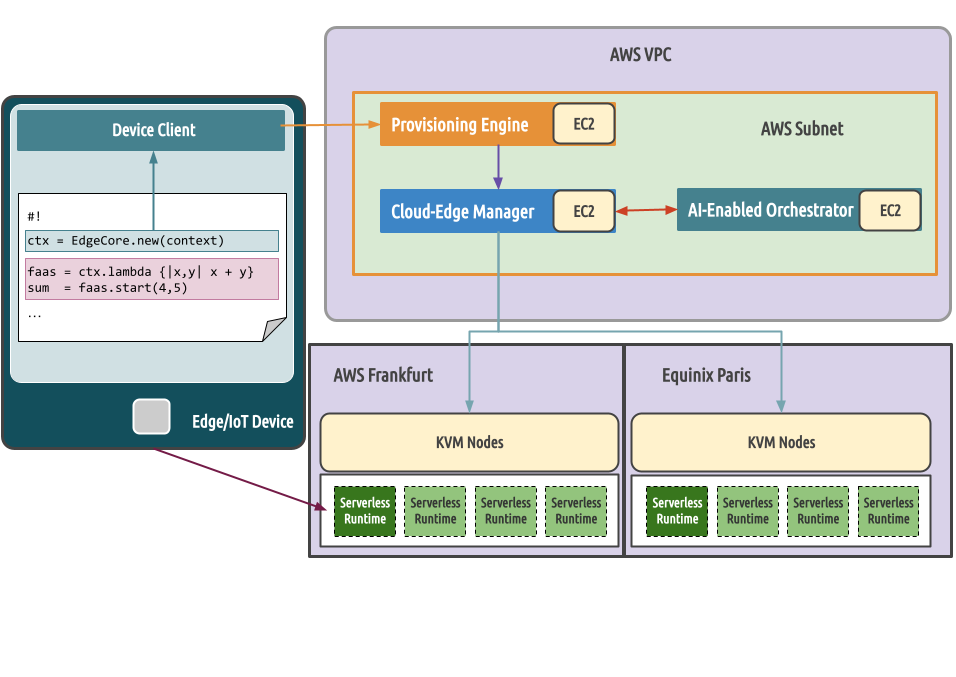

# COGNIT OpsForge

A Cognitive Serverless Framework for the Cloud-Edge Continuum. With OpsForge you can deploy the COGNIT Stack.



It will automatically deploy setup the following components on AWS or on the specified hosts

- [OpenNebula Frontend node](https://docs.opennebula.io/STS/installation_and_configuration/frontend_installation/overview.html)
- [Provision Engine](https://github.com/SovereignEdgeEU-COGNIT/provisioning-engine)
- [Serverless Runtime](https://github.com/SovereignEdgeEU-COGNIT/serverless-runtime)
- [AI Orchestrator](https://github.com/SovereignEdgeEU-COGNIT/ai-orchestrator)

Also you'll need a device client to make use of the infrastructure from your application

- [Device Client Python](https://github.com/SovereignEdgeEU-COGNIT/device-runtime-py)
- [Device Client C](https://github.com/SovereignEdgeEU-COGNIT/device-runtime-c)


## How to use

opsforge is a ruby CLI application that runs in your local machine. It will

- setup AWS infrastructure using terraform if required
- install and configure OpenNebula and the COGNIT services using ansible
- populate the frontend with content required by the COGNIT use cases using the opennebula terraform provider

As such, there are some requirements that need to be met in order to run the program

- [ruby](https://www.ruby-lang.org/en/documentation/installation/) and the gem [json-schema](https://rubygems.org/gems/json-schema)
- [terraform](https://developer.hashicorp.com/terraform/install?product_intent=terraform)
- [ansible](https://docs.ansible.com/ansible/latest/installation_guide/intro_installation.html)
  - [one-deploy](https://github.com/OpenNebula/one-deploy/releases/tag/release-1.0.0) is a required git submodule
- If using AWS
  - [awscli](https://docs.aws.amazon.com/cli/latest/userguide/getting-started-install.html)
  - a valid [ssh key](https://docs.aws.amazon.com/AWSEC2/latest/UserGuide/ec2-key-pairs.html) to connect to AWS EC2 instances

### Deploy

You can deploy the COGNIT Stack on AWS or on specific hosts for each component

Run `./opsforge deploy <opsforge_template>`

To check all of the options available for the opsforge template, please refer to [the template schema](./schema.json).

#### AWS

The deployment will create it's own VPC, Internet Gateway, subnets and Security Groups with the proper network configuration for the EC2 instances to communicate with each other and the internet. It can be done in any region as long as the instance type requested is available in it.

Example

```yaml
:aws:
  :region: "us-east-1"
  :ssh_key: <your_aws_named_ssh_key>
:one:
  :ee_token: <your_ee_token>
```

When finished, you should receive information about how to connect to each instance. For example

```json
Setting up infrastructure on AWS
Infrastructure on AWS has been deployed
Took 60.673237 seconds
Installing Frontend and Provisioning Engine
Frontend and Provisioning Engine installed
Took 402.92903 seconds
Setting up Frontend for Cognit
Frontend ready for Cognit
Took 29.167263 seconds

Infrastructure
{
  "frontend": "ec2-18-210-28-170.compute-1.amazonaws.com",
  "engine": "ec2-44-221-73-110.compute-1.amazonaws.com",
  "ai_orchestrator": "ec2-3-230-155-179.compute-1.amazonaws.com"
}

Connect to these hosts with the <ubuntu> user using the provided ssh key'
Logs available at ./opsforge.log'
Take a look at AWS cluster provisioning in order to setup your KVM cluster
https://docs.opennebula.org/stable/provision_clusters/providers/aws_provider.html#aws-provider
After that, take a look at the Energy Consumption extension
https://github.com/SovereignEdgeEU-COGNIT/opennebula-extensions?tab=readme-ov-file#scaphandre-extension
```

#### onprem

When deploying on specific hosts, the `:aws` key must not exist in the template, instead, specify each host hostname under the `:hosts` key. It is required to have root ssh access to said hosts.

Example

```yaml
:one:
  :ee_token: <your_ee_token>
  :sunstone_port: 80
  :fireedge_port: 443
:hosts:
    :frontend: 172.20.0.4
    :engine: 172.20.0.9
    :ai_orchestrator: 172.20.17
:cognit:
  :engine_port: 6969
```

##  Terminate

Once you no longer need the COGNIT deployment, you can easily delete the provisioned resources by issuing `./opsforge clean`.

For example

```bash
./opsforge clean
Destroying resources created on AWS
COGNIT deployment succesfully destroyed
```


