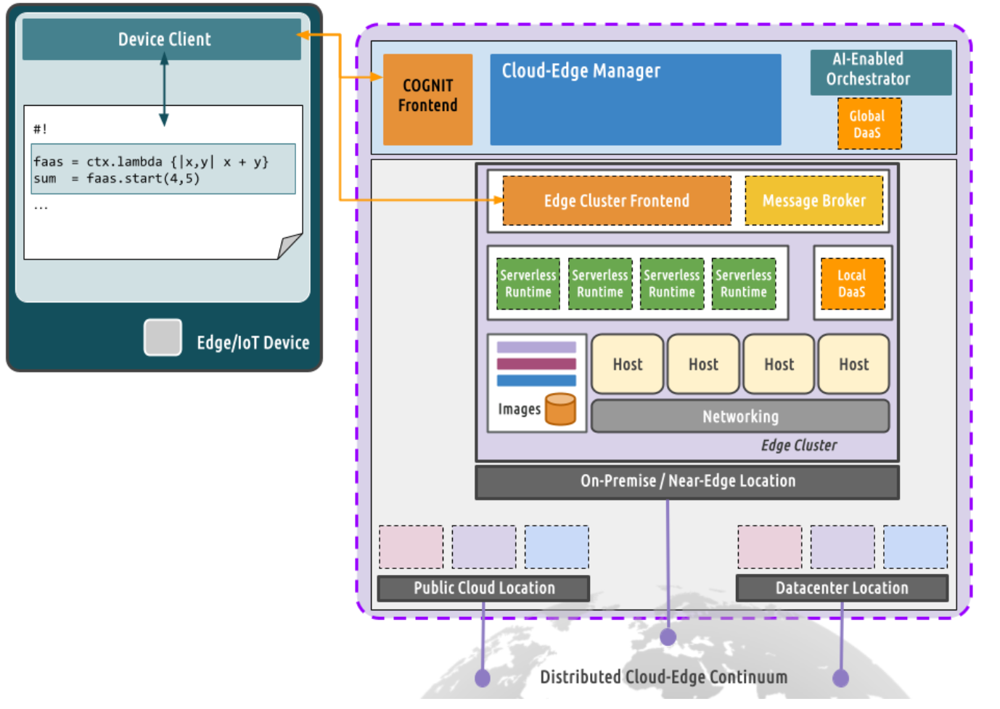

# COGNIT OpsForge

OpsForge deploys the COGNIT Stack on a target infrastructure, turning it into a Cognitive Serverless Framework for the Cloud-Edge Continuum.



The COGNIT Stack is built using the following components:

| Name                       | Documentation                                                                                                 | Testing                                                                                                        | Installation                                                                                                               |
|----------------------------|---------------------------------------------------------------------------------------------------------------|----------------------------------------------------------------------------------------------------------------|----------------------------------------------------------------------------------------------------------------------------|
| Device Client (Python)     | [Wiki documentation](https://github.com/SovereignEdgeEU-COGNIT/device-runtime-py/wiki)                        | [Test folder](https://github.com/SovereignEdgeEU-COGNIT/device-runtime-py/tree/main/cognit/test)               | [README](https://github.com/SovereignEdgeEU-COGNIT/device-runtime-py/blob/main/README.md)                                  |
| COGNIT Frontend            | [User guide](https://github.com/SovereignEdgeEU-COGNIT/cognit-frontend#use)                                   | [Test folder](https://github.com/SovereignEdgeEU-COGNIT/cognit-frontend#use)                                   | [Install guide](https://github.com/SovereignEdgeEU-COGNIT/cognit-frontend#install)                                         |
| EdgeCluster Frontend       | [User guide](https://github.com/SovereignEdgeEU-COGNIT/edgecluster-frontend#use)                              | [Test folder](https://github.com/SovereignEdgeEU-COGNIT/edgecluster-frontend/tree/main/tests)                  | [Install guide](https://github.com/SovereignEdgeEU-COGNIT/edgecluster-frontend#install)                                    |
| Device Client (C)          | N/A                                                                                                           | [Test folder](https://github.com/SovereignEdgeEU-COGNIT/device-runtime-c/tree/master/cognit/test)              | [README](https://github.com/SovereignEdgeEU-COGNIT/device-runtime-c/blob/master/README.md)                                 |
| OpenNebula                 | [Official](https://docs.opennebula.io/)                                                                       | [Q&A](https://github.com/OpenNebula/one/wiki/Quality-Assurance)                                                | [Install guide](https://docs.opennebula.io/7.0/installation_and_configuration/frontend_installation/index.html)            |
| Serverless Runtime         | [Wiki documentation](https://github.com/SovereignEdgeEU-COGNIT/serverless-runtime/wiki)                       | [Test folder](https://github.com/SovereignEdgeEU-COGNIT/serverless-runtime/tree/main/app/test)                 | [README](https://github.com/SovereignEdgeEU-COGNIT/serverless-runtime/blob/main/README.md)                                 |

OpsForge automatically deploys and configures:

- **OpenNebula Frontend** — Cloud-Edge Manager (oned, Sunstone, FireEdge, OneFlow)
- **COGNIT Frontend** — API gateway for device clients
- **Edge Cluster Frontend** — per-edge-site proxy and service orchestration (via `deploy-edge`)


## How to use

OpsForge is a Ruby CLI that runs on your local machine. It:

1. Installs OpenNebula and the COGNIT Frontend on a target host using [one-deploy](https://github.com/OpenNebula/one-deploy) + COGNIT Ansible playbooks
2. Optionally provisions edge cluster nodes and deploys the EdgeCluster Frontend via OneFlow

There is no Terraform required for on-premises deployments.

### Requirements

- [Ruby](https://www.ruby-lang.org/en/documentation/installation/) ≥ 3.0 and the gem [`json-schema`](https://rubygems.org/gems/json-schema)
- [Ansible](https://docs.ansible.com/ansible/latest/installation_guide/intro_installation.html) ≥ 2.14
- The `one-deploy` git submodule initialized: `git submodule update --init ansible/one-deploy`
- Root SSH access (key-based, no password) to all target hosts from the machine running OpsForge
- If using AWS: [Terraform](https://developer.hashicorp.com/terraform/install) ≥ 1.5 and [AWS CLI](https://docs.aws.amazon.com/cli/latest/userguide/getting-started-install.html)


### Internals: what happens under the hood

When you run `./opsforge deploy` or `./opsforge deploy-edge`, OpsForge:

1. Validates your template against `schema.json`
2. Generates `ansible/inventory.yaml` and `ansible/ansible.cfg` from the template values
3. Runs `ansible-playbook` from the `ansible/` directory using the following playbook chain:

**`deploy` (control plane):**
```
ansible/playbooks/cognit.yaml
  ├── Bootstrap: write internal APT repo (if one_internal_repo_url is set), apt update
  ├── opennebula.deploy.pre   (one-deploy: prechecks)
  ├── opennebula.deploy.site  (one-deploy: installs OpenNebula packages + services)
  └── cognit-frontend.yaml    (installs COGNIT Frontend service)
```

**`deploy-edge` (edge cluster):**
```
ansible/playbooks/edge-only.yaml
  └── edge-cluster.yaml
        ├── Distribute SSH keys to edge hosts
        ├── Pre-configure edge hosts (repo, packages)
        ├── Create OnPrem provider + oneprovision cluster
        ├── Wait for provision to reach RUNNING/DONE
        ├── Sync ONE remotes to edge hosts
        ├── Export marketplace app for the flavour (e.g. NatureFR)
        ├── Wait for images to be READY
        ├── Instantiate OneFlow service
        ├── Configure nginx ECF proxy on edge host
        └── Update cluster template (EDGE_CLUSTER_FRONTEND, FLAVOURS, PROVIDER, GEOLOCATION)
```

The `one-deploy` submodule is used as an Ansible collection (`opennebula.deploy`). Its `collections_path` is set to `ansible/one-deploy/ansible_collections/` in the generated `ansible.cfg`.


## Deploy

### Step 1 — Deploy the control plane

```bash
./opsforge deploy <template.yaml>
```

This installs OpenNebula + COGNIT Frontend on a single host. The template must provide the frontend host and the oneadmin password.

**On-premises template example:**

```yaml
:infra:
  :hosts:
    :frontend: "192.0.2.10"        # IP or hostname, root SSH access required
:cognit:
  :one_pass: "mypassword"          # oneadmin password
  :one_internal_repo_url: "http://5.2.88.196/repo/"   # optional: internal APT repo
  :one_internal_repo_component: "poc-cognit"           # optional: APT component
```

**AWS template example:**

```yaml
:infra:
  :aws:
    :region: "eu-central-1"
    :ssh_key: "my-aws-key"
:cognit:
  :one_pass: "mypassword"
```

When the deployment completes, OpsForge prints the access URLs:

```
================================================================================

Infrastructure
{"frontend": "192.0.2.10"}

Access
- Cloud-Edge Manager: oneadmin / mypassword
- Sunstone:    http://192.0.2.10:9869
- FireEdge:    http://192.0.2.10:2616
- COGNIT Frontend: http://192.0.2.10:1338
- SSH: Connect to the frontend "192.0.2.10" as root.

Logs available at ./opsforge.log
```

### Step 2 — Deploy edge clusters

Once the control plane is up, provision one or more edge clusters with:

```bash
./opsforge deploy-edge <edge_template.yaml>
```

This requires no Terraform — it runs only Ansible against the existing frontend. The template must point to the already-deployed frontend and provide at least one edge host IP.

**Edge template example:**

```yaml
:infra:
  :hosts:
    :frontend: "192.0.2.10"        # existing frontend (from Step 1)
:cognit:
  :one_pass: "mypassword"
  :one_internal_repo_url: "http://5.2.88.196/repo/"
  :one_internal_repo_component: "poc-cognit"
  :flavour: "NatureFR"             # use-case flavour (see below)
  :provider: "OnPrem"              # provider name for cluster metadata
  :geolocation: "48.8566,2.3522"  # optional: lat,lon
  :edge_host_ips:
    - "192.0.2.20"                 # one or more edge hosts, root SSH access required
```

**Available flavours:** `NatureFR`, `SmartCity`, `EnergyTorch`, `Energy`, `CyberSecurity`

> Edge hosts must be reachable by SSH from the **frontend host**. The `deploy-edge` command connects to the frontend and delegates all edge-host operations from there.

### Template reference

All available fields are described in [`schema.json`](./schema.json). Key fields:

| Field | Required for | Description |
|---|---|---|
| `:infra: :hosts: :frontend:` | `deploy` (on-prem), `deploy-edge` | Frontend host IP/hostname |
| `:infra: :aws:` | `deploy` (AWS) | AWS configuration block |
| `:cognit: :one_pass:` | both | oneadmin password |
| `:cognit: :one_version:` | both | OpenNebula version (default: `7.1`) |
| `:cognit: :one_internal_repo_url:` | optional | Internal APT repo URL |
| `:cognit: :one_internal_repo_component:` | optional | APT component (default: `poc-cognit`) |
| `:cognit: :edge_host_ips:` | `deploy-edge` | List of edge host IPs |
| `:cognit: :flavour:` | `deploy-edge` | Use-case flavour name |
| `:cognit: :provider:` | `deploy-edge` | Provider name for cluster metadata |
| `:cognit: :geolocation:` | `deploy-edge` | Cluster geolocation `"lat,lon"` |


## Build SR Appliance

A separate workflow builds the Serverless Runtime appliance using [kiwi](https://osinside.github.io/kiwi/index.html):

```bash
./opsforge build_sr <host> [sr_version] [jumphost] [flavour]
```

The target host must be an OpenSUSE machine with ~10 GB of free space. The result is a qcow2 image at `/root/kiwi-image/output/cognit-sr.x86_64-1.0.0.qcow2` on the build host.

```bash
./opsforge build_sr 172.20.0.5
# ...
# The appliance was generated at 172.20.0.5:/root/kiwi-image/output/cognit-sr.x86_64-1.0.0.qcow2
```


## Terminate

To destroy AWS infrastructure provisioned by OpsForge:

```bash
./opsforge clean
```

This runs `terraform destroy` on the AWS stack and removes generated config files. On-premises deployments must be cleaned up manually.
