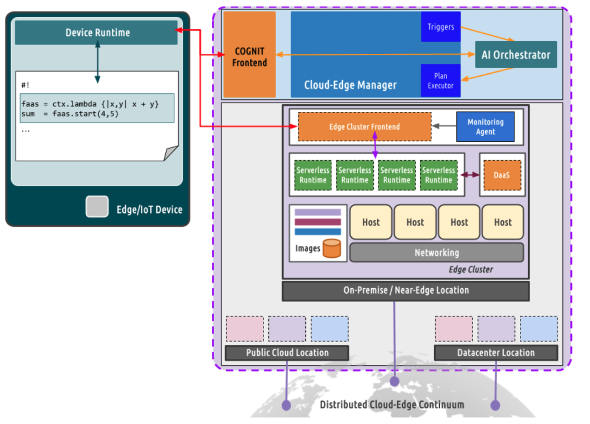

# COGNIT OpsForge

OpsForge let's you deploy the COGNIT Stack in a target infrastructure, turning it into a Cognitive Serverless Framework for the Cloud-Edge Continuum.



The COGNIT Stack is built using the following components:

| Name                       | Documentation                                                                                                 | Testing                                                                                                        | Installation                                                                                                               |
|----------------------------|---------------------------------------------------------------------------------------------------------------|----------------------------------------------------------------------------------------------------------------|----------------------------------------------------------------------------------------------------------------------------|
| Device Client (Python)     | [Wiki documentation](https://github.com/SovereignEdgeEU-COGNIT/device-runtime-py/wiki)                        | [Test folder](https://github.com/SovereignEdgeEU-COGNIT/device-runtime-py/tree/main/cognit/test)               | [README](https://github.com/SovereignEdgeEU-COGNIT/device-runtime-py/blob/main/README.md)                                  |
| Device Client (C)          | N/A                                                                                                           | [Test folder](https://github.com/SovereignEdgeEU-COGNIT/device-runtime-c/tree/master/cognit/test)              | [README](https://github.com/SovereignEdgeEU-COGNIT/device-runtime-c/blob/master/README.md)                                 |
| OpenNebula                 | [Official](https://docs.opennebula.io/)                                                                       | [Q&A](https://github.com/OpenNebula/one/wiki/Quality-Assurance)                                                | [Install guide](https://docs.opennebula.io/6.8/installation_and_configuration/frontend_installation/index.html)            |
| Serverless Runtime         | [Wiki documentation](https://github.com/SovereignEdgeEU-COGNIT/serverless-runtime/wiki)                       | [Test folder](https://github.com/SovereignEdgeEU-COGNIT/serverless-runtime/tree/main/app/test)                 | [README](https://github.com/SovereignEdgeEU-COGNIT/serverless-runtime/blob/main/README.md)                                 |
| Provision Engine           | [User guide](https://github.com/SovereignEdgeEU-COGNIT/provisioning-engine/wiki/User-Guide)                   | [GitHub Actions](https://github.com/SovereignEdgeEU-COGNIT/provisioning-engine/actions/workflows/rspec.yaml)   | [Admin guide](https://github.com/SovereignEdgeEU-COGNIT/provisioning-engine/wiki/Admin-Guide)                              |
| AI Orchestrator            | [User guide](https://github.com/SovereignEdgeEU-COGNIT/ai-orchestrator/blob/main/README.md)                   | [Testing doc](https://github.com/SovereignEdgeEU-COGNIT/ai-orchestrator/blob/main/README.md#Testing)           | [Install guide](https://github.com/SovereignEdgeEU-COGNIT/ai-orchestrator/blob/main/README.md)                             |

OpsForge will automatically deploy and configure the following components on the target infrastructure:

- [OpenNebula Frontend node](https://docs.opennebula.io/STS/installation_and_configuration/frontend_installation/overview.html). All needed resources, like the Serverless Runtime templates, are created.
- [Provision Engine](https://github.com/SovereignEdgeEU-COGNIT/provisioning-engine)
- [AI Orchestrator](https://github.com/SovereignEdgeEU-COGNIT/ai-orchestrator)
- [Serverless Runtime](https://github.com/SovereignEdgeEU-COGNIT/serverless-runtime) appliance

Afterwards you will need to manually setup

- [Compute nodes](https://docs.opennebula.io/6.8/open_cluster_deployment/kvm_node/overview.html) and [networking](https://docs.opennebula.io/6.8/open_cluster_deployment/networking_setup/index.html), either manually or using the [public cloud providers](https://docs.opennebula.io/6.8/provision_clusters/providers/overview.html).

Also you'll need a device client to make use of the infrastructure from your application

- [Device Client Python](https://github.com/SovereignEdgeEU-COGNIT/device-runtime-py)
- [Device Client C](https://github.com/SovereignEdgeEU-COGNIT/device-runtime-c)


## How to use

OpsForge is a ruby CLI application that runs in your local machine. It will:

- setup AWS infrastructure using terraform if required
- install and configure OpenNebula and the COGNIT services using ansible
- populate the frontend with content required by the COGNIT use cases using the opennebula terraform provider

As such, there are some requirements that need to be met in order to run the program.

- [ruby](https://www.ruby-lang.org/en/documentation/installation/) 3.2.2 and the gem [json-schema](https://rubygems.org/gems/json-schema) 4.1.1
- [terraform](https://developer.hashicorp.com/terraform/install?product_intent=terraform) 1.5.7
- [ansible](https://docs.ansible.com/ansible/latest/installation_guide/intro_installation.html) 2.16.2
  - [one-deploy](https://github.com/OpenNebula/one-deploy/releases/tag/release-1.0.0) is a required git submodule
- If using AWS
  - [awscli](https://docs.aws.amazon.com/cli/latest/userguide/getting-started-install.html) 2.15.30
  - a valid [ssh key](https://docs.aws.amazon.com/AWSEC2/latest/UserGuide/ec2-key-pairs.html) to connect to AWS EC2 instances

> [!IMPORTANT]
> The dependency versions shown are guaranteed to work, older or recent versions might work as well, but it is not guaranteed.

### Deploy

There are two kinds of target infrastructure that are valid for OpsForge, you can deploy the COGNIT Stack on AWS or on a private datacenter, provided SSH access to the resources.

To run opsforge, you need to clone this repository and run `./opsforge deploy <opsforge_template>`

To check all of the options available for the opsforge template, please refer to [the template schema](./schema.json).

The deployment will be conducted as follows

```
    +---------------+
    |Public Internet|
    +---------------+
            |
            |
            |
            |
    +-------v-----------+ +----------------+ +--------------+-------------+
    | Ingress Controller| |  Cloud-Edge    | | Provisioning | Ai          |
    | public ipv4       | |    Manager     | | Engine       | Orchestrator|
    | 10.0.1.x          | |   10.0.1.x     | | 10.0.1.x     | 10.0.1.x    |
    +-------------------+ +----------------+ +--------------+-------------+
             |                 |                  |              |
             +-----------------+------------------+--------------+
                                10.0.1.0/24
```

The Ingress controller is a special host which hides the COGNIT components behind a web server, providing API redirection for the Cloud-Edge manager web interfaces and the Provisioning Engine with SSL encryption. It also acts as a management entry point, working as an SSH jump host/bastion. Finally, it also acts as a router for the private subnet hosting the COGNIT components.
When deploying with AWS, these conditions will be automatically met. When deploying on-premises/with managed hosts, these conditions must be previously present.

SSL certificates can be passed in the template with

```yaml
:cognit:
  :certificate:
    :crt: '~/certificate.crt' # a path to upload
    :key: '~/certificate.key' # a path to upload
```

if not, they will be generated automatically and placed at `~/.cognit_ssl_certs`


#### AWS


The deployment will create it's own VPC, Internet Gateway, subnets and Security Groups with the proper network configuration for the EC2 instances to communicate with each other and the internet. It can be done in any region as long as the instance type requested is available in it.

Example

```yaml
:infra:
  :aws:
    :region: "us-east-1"
    :ssh_key: <your_aws_named_ssh_key>
:cognit:
  :cloud:
    :ee_token: <your_ee_token>
```

When finished, you should receive information about how to connect to each instance. For example

```json
Frontend ready for Cognit
Took 63.20396 seconds

Infrastructure
{
  "cloud": "10.0.1.72",
  "engine": "10.0.1.236",
  "ai_orchestrator": "10.0.1.45",
  "ingress": "ec2-3-72-10-111.eu-central-1.compute.amazonaws.com"
}

Access
- Cloud-Edge Manager credentials: oneadmin:uCw1NhdNyJ9g7OAd
- Provision Engine: https://ec2-3-72-10-111.eu-central-1.compute.amazonaws.com/engine
- Stable Web UI:    https://ec2-3-72-10-111.eu-central-1.compute.amazonaws.com/sunstone
- Next Gen Web UI:  https://ec2-3-72-10-111.eu-central-1.compute.amazonaws.com/fireedge
- SSH: Connect to the host "ec2-3-72-10-111.eu-central-1.compute.amazonaws.com" with the "ubuntu" user, using the provided ssh key. You can access the rest of the cluster using this host as an SSH jump host.
- SSL: Certificate files at /Users/dann1/.cognit_ssl_certs

Take a look at AWS cluster provisioning in order to setup your KVM cluster
https://docs.opennebula.org/stable/provision_clusters/providers/aws_provider.html#aws-provider
After that, take a look at the Energy Consumption extension
https://github.com/SovereignEdgeEU-COGNIT/opennebula-extensions?tab=readme-ov-file#scaphandre-extension

Logs available at ./opsforge.log'
```

#### On Premises (Private Datacenter)


When deploying on specific hosts, the `:aws` key must not exist in the template, instead, specify each host hostname under the `:hosts` key. It is **required** to have root ssh access to said hosts.

Example

```yaml
:infra:
  :hosts:
    :ingress: 172.20.0.1
    :cloud: 172.20.0.4
    :engine: 172.20.0.9
    :ai_orchestrator: 172.20.17
:cognit:
  :app:
    :base: http://app_server.cognit/base_app # Replace with publicly available app
  :certificate:
    :crt: '~/certificate.crt'
    :key: '~/certificate.key'
  :engine:
    :version: release-1.3.4
  :ai_orchestrator:
    :version: dev_branch
  :cloud:
    :version: 6.8
    :ee_token: <enterprise_edition token for Cloud Edge Manager>
    :extensions:
      :version: main
```

> [!IMPORTANT]
> The automatic deployment has been designed for Ubuntu 2204 hosts. It might not work if these hosts have different OS.


## Build SR appliance

A separate workflow exists to build the SR appliance. Underneath it uses [kiwi](https://osinside.github.io/kiwi/index.html) to perform the boostrap process.

 In order to trigger the build process, run

```
./opsforge build_sr <host>
```

Replace host with the hostname/IP address of the machine that will build the SR appliance.

> [!WARNING]
> This machine needs to be a SUSE host and should have enough space available to bootrstrap a new image, about 10 GB should be enough.

It will take a while since it needs to boostrap an entire operating system. The result will be a qcow2 image containing an OpenSUSE Guest OS ready to run in OpenNebula with the [Serverless Runtime software](https://github.com/SovereignEdgeEU-COGNIT/serverless-runtime).

Example

```
./opsforge build_sr 172.20.0.5

PLAY [Setup kiwi builder] ******************************************************

TASK [Gathering Facts] *********************************************************
[WARNING]: Platform linux on host kiwi1 is using the discovered Python
interpreter at /usr/bin/python3.6, but future installation of another Python
interpreter could change the meaning of that path. See
https://docs.ansible.com/ansible-
core/2.16/reference_appendices/interpreter_discovery.html for more information.
ok: [kiwi1]

TASK [kiwi : Verify openSUSE distribution] *************************************
skipping: [kiwi1]

TASK [kiwi : Install required packages] ****************************************
ok: [kiwi1]

TASK [kiwi : Copy kiwi image description files] ********************************
ok: [kiwi1]

TASK [kiwi : Check if output directory exists and is not empty] ****************
ok: [kiwi1]

TASK [kiwi : Clean up output directory] ****************************************
changed: [kiwi1]

TASK [kiwi : Create empty output directory] ************************************
changed: [kiwi1]

TASK [kiwi : Build kiwi image] *************************************************
changed: [kiwi1]

TASK [kiwi : Convert raw image to qcow2] ***************************************
changed: [kiwi1]

PLAY RECAP *********************************************************************
kiwi1                      : ok=8    changed=4    unreachable=0    failed=0    skipped=1    rescued=0    ignored=0

The appliance was generated at 172.20.0.5:/root/kiwi-image/output/cognit-sr.x86_64-1.0.0.qcow2

## If we check on the host we find

ls -l /root/kiwi-image/output/
total 3783344
drwxr-xr-x 3 root root         46 May 18 00:33 build
-rw-r--r-- 1 root root   16097710 May 18 00:41 cognit-sr.x86_64-1.0.0.changes
-rw-r--r-- 1 root root  625147904 May 18 00:54 cognit-sr.x86_64-1.0.0.install.iso
-rw-r--r-- 1 root root      64306 May 18 00:41 cognit-sr.x86_64-1.0.0.packages
-rw-r--r-- 1 root root 1597308928 May 18 00:54 cognit-sr.x86_64-1.0.0.qcow2
-rw-r--r-- 1 root root 2105540608 May 18 00:41 cognit-sr.x86_64-1.0.0.raw
-rw-r--r-- 1 root root       1577 May 18 00:41 cognit-sr.x86_64-1.0.0.verified
-rw-r--r-- 1 root root      10333 May 18 00:54 kiwi.result
-rw-r--r-- 1 root root        960 May 18 00:54 kiwi.result.json

```


##  Terminate

Once you no longer need the COGNIT deployment, you can easily delete the provisioned resources by issuing `./opsforge clean`.

For example

```bash
./opsforge clean
Destroy complete! Resources: 14 destroyed.

COGNIT deployment succesfully destroyed
```


